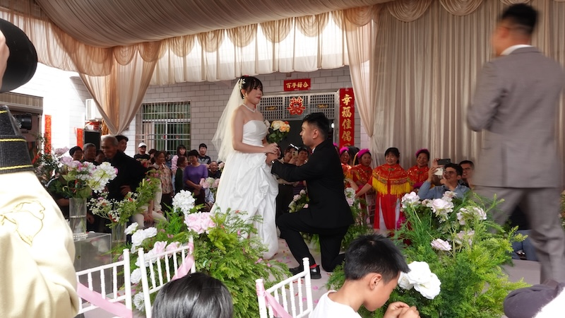

### 许久没见的长辈
见到一位我很喜欢的长辈，上次见还是很正常的一个人，因为得了某种病，现在已经无法正常表达。听说他的病无法治愈，后面只会越来越严重。人生无常，生命脆弱。

### 参加婚礼

在老家参加了次婚礼，在老家自建房办酒席，村里年轻人大都在外工作，所以来的长辈居多。  
参加这场婚礼给我的感触是，能看出大家都很享受这场婚礼。  
我认为有几个原因。  
第一个是婚礼在老家办，大多都是村里的人，大家都很熟悉。  
第二个是婚礼在室外，大家都能参与进来，比较随意。  
第三个是婚礼流程很丰富，村里人自发组织了很多节目。  
而不像以往在酒店参加的婚礼，大家都是陌生人，婚礼流程比较单一。  
以后结婚，我可能会考虑在老家办酒席，让大家都参与进来，而不是办一场酒席，大家只是完成任务式的参与。

### 黑神话悟空
节假日最后三天时间都花在黑神话悟空了，打完了小西天、盘丝洞、现在到了火焰山。补做完了一些隐藏剧情，紫云山、画卷等。
越来越觉得游戏科学了不起，剧情、美术、设计都做得无可挑剔。另外，今天被八戒的剧情感动到了。